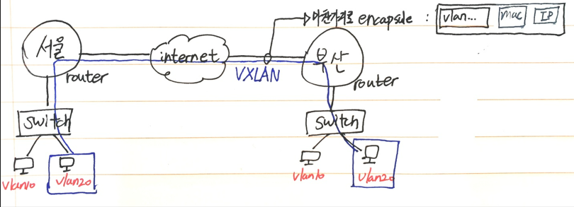

---
# 속성은 대쉬 내부에 작성하세요

# 영문으로 같은 내용 작성 시 id 같아야 함
lng_pair: id_kakao_mariadb0
# 영문으로 작성하는 경우 영문제목
title: (MariaDB)기본 개념 익히기

# 저자 설정(생략 가능)
#author: initializer

# 카테고리와 태그 설정
category: 카카오클라우드스쿨
tags: [Database, MariaDB, Linux]

# 섬네일 이미지
img: "https://avatars.githubusercontent.com/u/5877084?s=280&v=4"

# 댓글 비활성화 여부
comments_disable: false

# 작성 날짜
date: 2022-07-13 09:48:51 +0900

# image_lazy_loader_posts = false 혹은 image_viewer_posts = false인 경우에만 사용하세요
#image_viewer_on: true
#image_lazy_loader_on: true

# 블로그내 검색 혹은 검색 엔진 검색에서 예외할건가
#on_site_search_exclude: true
#search_engine_exclude: true

# to disable this page, simply set published: false or delete this file
#published: false
---

<!-- outline-start -->

[카카오 클라우드 스쿨] MariaDB를 배우는 데 필요한 기본 개념 익혀보자

<!-- outline-end -->

# MariaDB (0) - 관련 개념

* RDBMS는 데이터의 무결성을 보장받기 위해 제약조건을 사용한다
  * 많은 쿼리 발생 시 느린 건 어쩔 수 없다
  * 따라서 **튜닝**이 아주 중요함(적은 리소스로 빠르게)

 

* Index
  * 처리 속도를 향상시킬 수 있는 튜닝 기법 중 하나
  * 특정 열에 대해 Index를 부여하면, 이를 통해 관련된 데이터를 빠르게 찾을 수 있다 (적은 수고로 빠르게 쿼리 가능)
  * ex) 책 뒷장에 특정 단어에 대한 페이지가 표시되는 것과 원리가 비슷함
  * 잘못 사용할 경우 독이 될 수 있다

 

* view
  * 

 

* 제약 조건
  * 무결성을 보장하기 위한 제한된 조건
  * PF, FK, Unique, Check, Default 정의, NULL 허용   

  * 무결성 개념 이해(online md5 generator)
    * 어떤 데이터를 일정한 길이로 만들 수 있는 해시
    * 
    * 무결성을 보장받기에는 너무 짧다
    * sha를 쓰면 더 긴 해시, 무결성을 보장받을 수 있게 됨

 

* userid char(8) primary key 로 생성
  * (별도로 NULL표시할 필요가 없음)
  * primary key(userid) 로 확인 가능

 

* 외래키(FK)
  * 두 테이블 사이의 관계를 통해 무결성을 보장받을 수 있다
  * FK를 따라가면 부모 테이블에서 유일한 값을 얻을 수 있다

 

* CASCADE
  * 원본 테이블의 PK의 데이터가 변경된 경우, 연결된 FK의 데이터도 함께 변경되거나 삭제되도록 할 수 있다
    * 설정을 해 줘야함

 

* UNIQUE
  * PK와 동일하지만, NULL을 허용한다. 보통 ID가 PK라면 휴대폰 번호는 Unique로 지정할 수 있다

 

* CHECK
  * CHECK 제약 조건은 프론트엔드에서의 데이터 유효성 검사처럼, DB에 등록 하기 전 값의 범위나 조건 들을 제시하여 해당 조건에 부합하는 경우에만 데이터 Insert 가능하게끔 할 수 있음

 

* 3-Tier Application
  * Web - Was - DB로 구성된 3 티어 애플리케이션
  * 
  * 이러한 구조는 클라우드 환경에서 매우 중요하다
  * 
  * 다음과 같이 수평 오토스케일링(스케일 인-아웃)을 적용할 수 있음
  * 

 

* Default 정의
  * NOT NULL에서 데이터를 입력하지 않으면, 자동으로 입력되도록 하는 기본 값을 지정
  * ex) 지역을 입력하지 않을 경우, 자동으로 '서울로'로 입력하게끔 함 (Not NULL 조건을 부합하도록 함)

 

* NULL 허용
  * null을 허용하여 값이 입력되지 않아도 DB에 다른 열 정보가 입력되도록 한다

 

